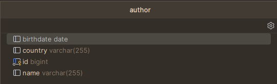
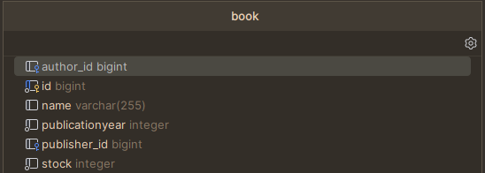
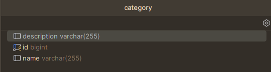
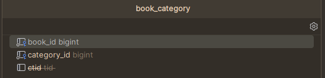
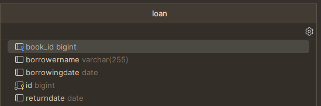
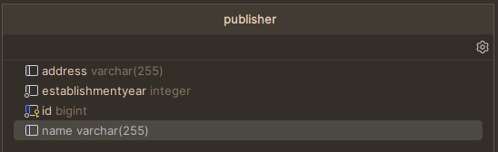

| TYPE   | URL                                  | DESC                                           |
|--------|--------------------------------------|------------------------------------------------|
| GET    | /api/books                           | Retrieves all books                            |
| GET    | /api/categories                      | Retrieves all categories                       |
| DELETE | /api/categories/delete-category/{id} | Deletes the category with the given id         |
| GET    | /api/loans                           | Retrieves all loans                            |
| GET    | /api/loans/{id}                      | Retrieves the loan with the given id           |
| POST   | /api/loans/lend-book                 | Inserts the given Loan object given in Body    |
| PUT    | /api/loans/update                    | Updates the Loan with the object given in Body |
| GET    | /api/publishers                      | Retrieves all publishers                       |
| GET    | /api/publishers/{id}                 | Retrieves the publisher with the given id      |

You may find the tables created by the application below:

Author

Book

Category

Book & Category

Loan

Publisher

