# Nighter the Game
## A text based RPG game

# Class Diagrams
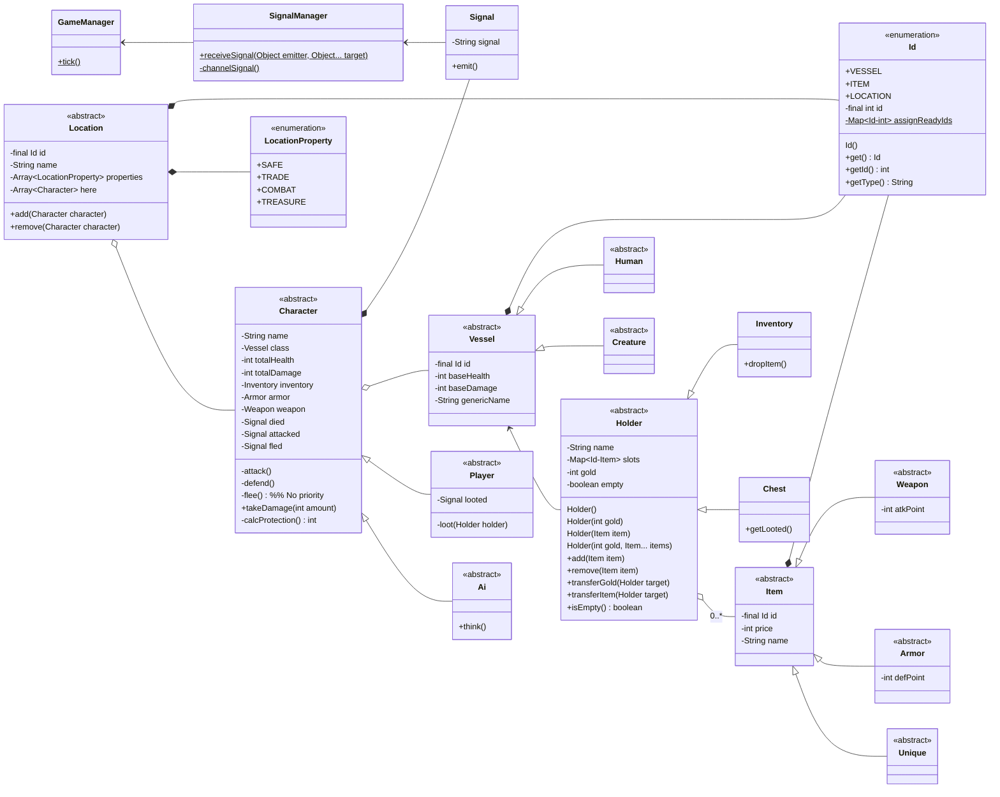
## Utils
### Printer
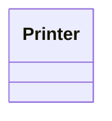

## Input
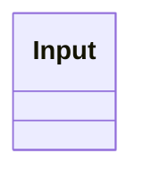

## Managers
### Signal Manager
Signal Manager channels the signals emitted by the use of Classes.  
For example: Vessel1 attacked Vessel2, Vessel.takeDamage() will be called on Vessel2 by Obj.takeDamage()  
Switch Case could be used for it.
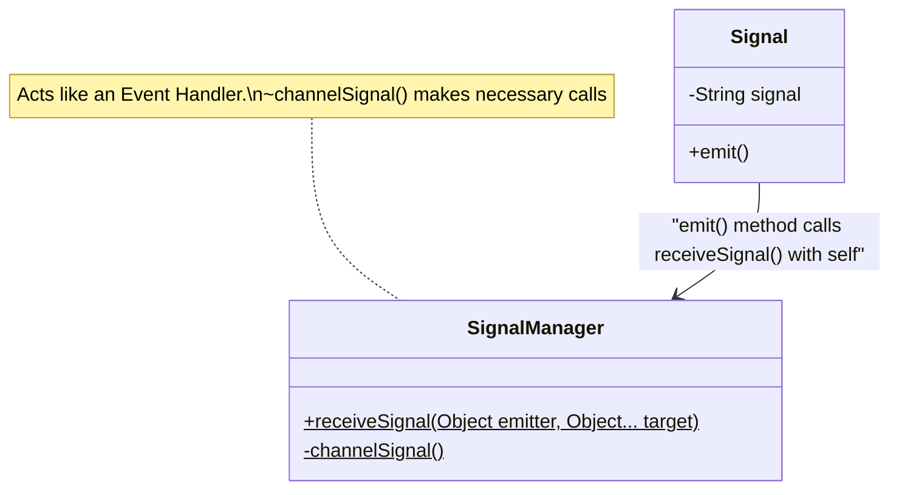

### Game Manager
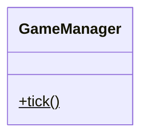

### Id and LocationProperty
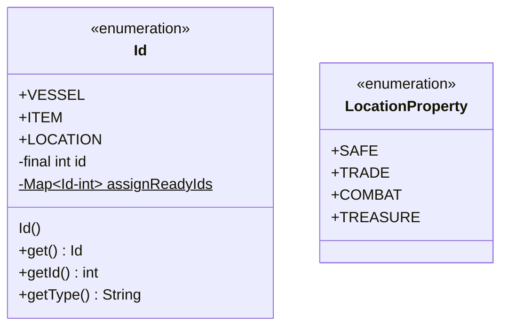

## Character
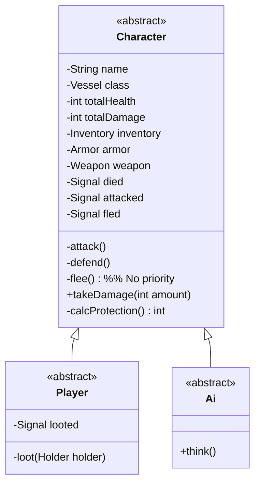

## Vessels
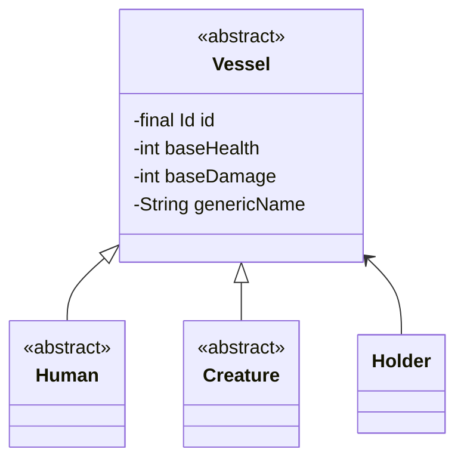

## Holders
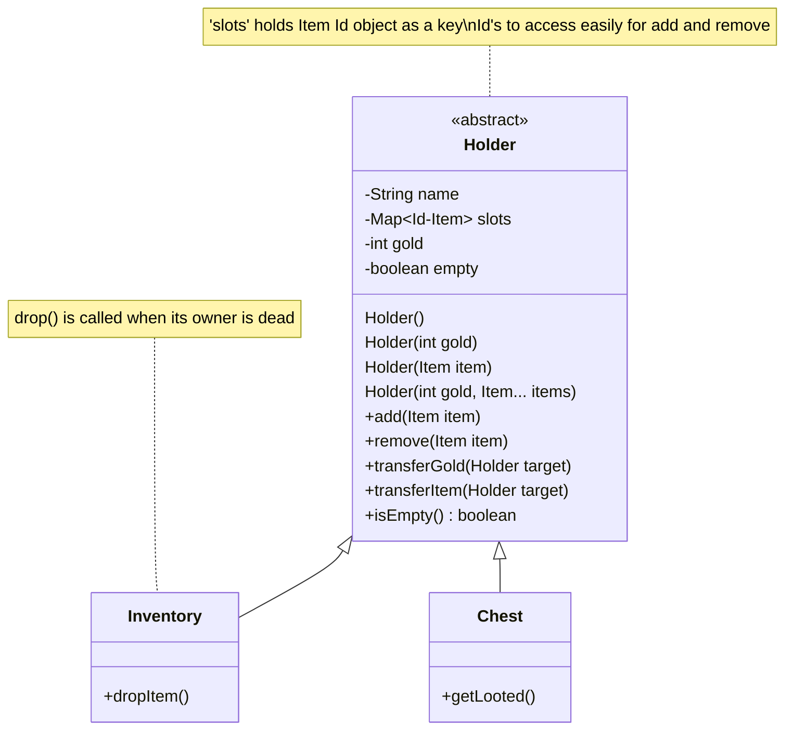

## Items
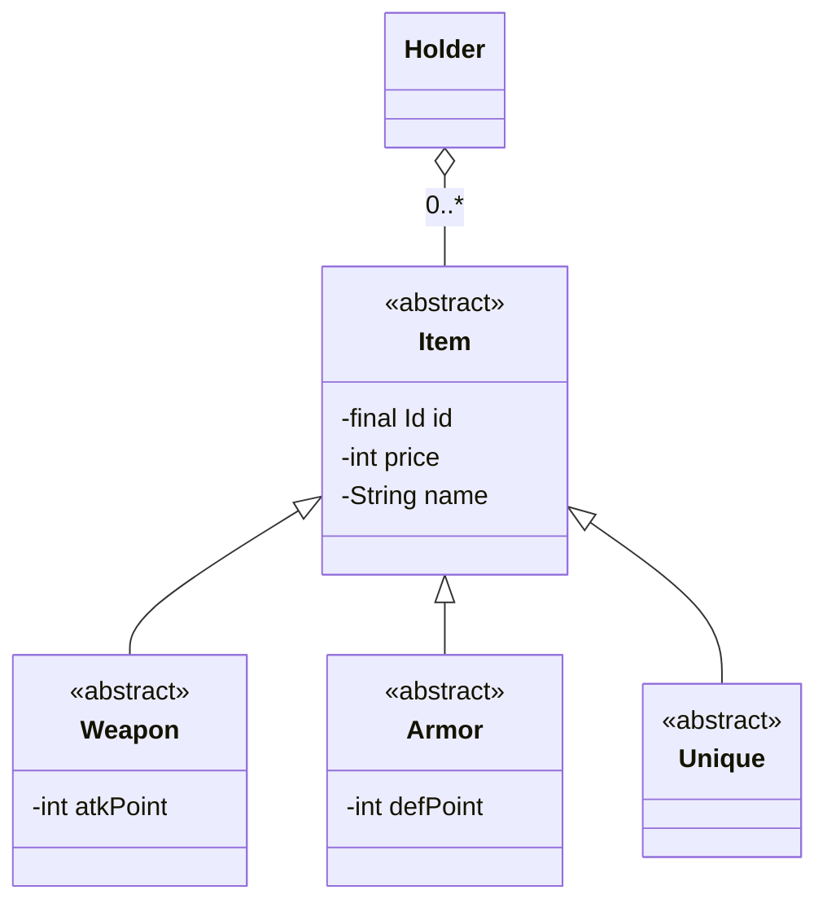

## Locations
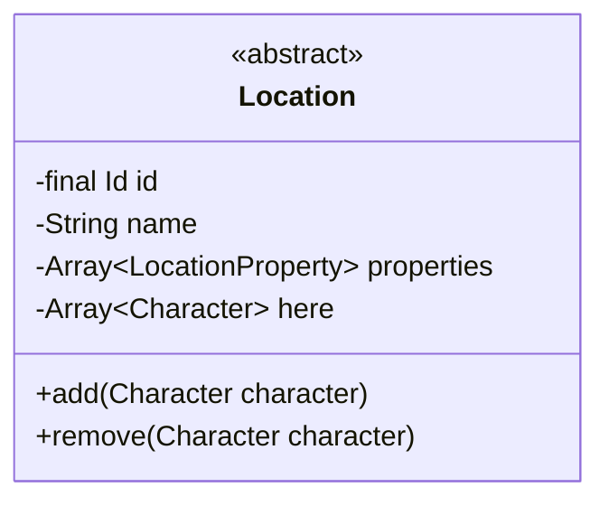